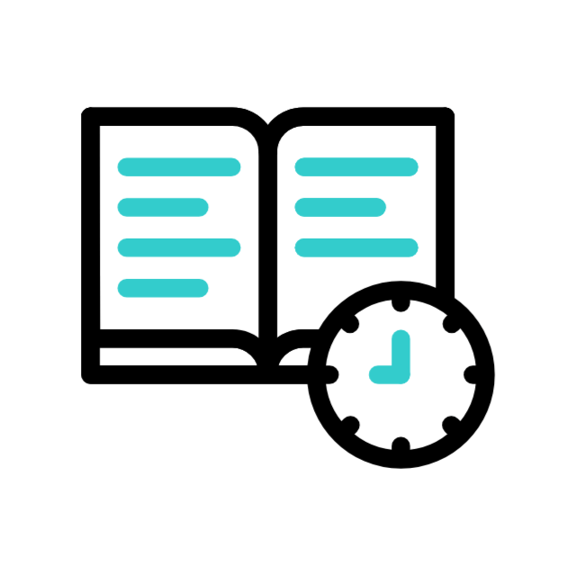
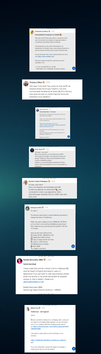

# 🚀 Mentoria Solutecn 2.0


## 📋 Sobre o Projeto

A **Mentoria Solutecn** é uma landing page moderna e responsiva desenvolvida para promover um curso de formação profissional em QA (Quality Assurance). O projeto oferece uma experiência completa para usuários interessados em ingressar na área de testes de software, apresentando informações detalhadas sobre o curso, mentor, benefícios e oportunidades de carreira.

### 🎯 Objetivo

Transformar a carreira de profissionais através de uma formação completa em QA, oferecendo:

- Conhecimento prático em testes de software
- Metodologias ágeis e tradicionais
- Automação de testes com Cypress
- Preparação para o mercado de trabalho
- Suporte direto com o mentor

### 🌐 Site Online

🔗 **[Acesse o site em produção](https://mentoria-solutecn.netlify.app/)**

## 🛠️ Tecnologias Utilizadas

### Frontend

- **Next.js 15.3.1** - Framework React com App Router
- **React 19.0.0** - Biblioteca para interface de usuário
- **TypeScript 5** - Tipagem estática para JavaScript
- **Tailwind CSS 4** - Framework CSS utilitário

### Bibliotecas e Componentes

- **Radix UI** - Componentes acessíveis e customizáveis
- **Lucide React** - Ícones modernos
- **React Icons** - Biblioteca de ícones
- **AOS (Animate On Scroll)** - Animações de scroll
- **TSParticles** - Efeitos de partículas interativas
- **Embla Carousel** - Carrossel responsivo

### Fontes

- **Geist** - Fonte principal
- **Roboto** - Fonte secundária

## 🏗️ Arquitetura do Projeto

```
src/
├── app/
│   ├── _components/          # Componentes da aplicação
│   │   ├── hero.tsx         # Seção principal
│   │   ├── header.tsx       # Navegação
│   │   ├── footer.tsx       # Rodapé
│   │   ├── modules.tsx      # Módulos do curso
│   │   ├── benefits.tsx     # Benefícios
│   │   ├── aboutMentor.tsx  # Sobre o mentor
│   │   ├── valueCourse.tsx  # Valores do curso
│   │   ├── faq.tsx          # Perguntas frequentes
│   │   ├── contacts.tsx     # Contatos
│   │   ├── floatingButtons.tsx # Botões flutuantes
│   │   └── ...
│   ├── globals.css          # Estilos globais
│   ├── layout.tsx           # Layout principal
│   └── page.tsx             # Página inicial
├── components/
│   └── ui/                  # Componentes UI reutilizáveis
│       └── accordion.tsx    # Componente accordion
└── lib/
    └── utils.ts             # Utilitários
```

### 🎨 Design System

O projeto utiliza um design system consistente com:

- **Cores primárias**: Tons de azul ciano (#00FFFF) e preto (#0F0F0F)
- **Tipografia**: Hierarquia clara com Geist e Roboto
- **Componentes**: Reutilizáveis e acessíveis
- **Responsividade**: Mobile-first approach

## 🖼️ Preview do Projeto

### 🏠 Página Principal


_Seção principal com call-to-action e apresentação do mentor_

### 📚 Módulos do Curso


_Apresentação dos módulos de aprendizado_

### 💼 Benefícios da Carreira


_Destaque dos principais benefícios de trabalhar com QA_

### 👨‍🏫 Sobre o Mentor


_Apresentação do mentor Isaac Ferreira_

### 📱 Design Responsivo


_Versão mobile otimizada_

## 🚀 Como Executar o Projeto

### Pré-requisitos

- Node.js 18+
- npm ou yarn

### Instalação

1. **Clone o repositório**

```bash
git clone https://github.com/seu-usuario/mentoria-solutecn-2.0.git
cd mentoria-solutecn-2.0
```

2. **Instale as dependências**

```bash
npm install
# ou
yarn install
```

3. **Execute o projeto em modo desenvolvimento**

```bash
npm run dev
# ou
yarn dev
```

4. **Acesse no navegador**

```
http://localhost:3000
```

### Build para Produção

```bash
npm run build
npm start
```

## 📱 Funcionalidades

### ✨ Principais Recursos

- **Design Responsivo** - Otimizado para todos os dispositivos
- **Animações Suaves** - Efeitos AOS e partículas interativas
- **Navegação Intuitiva** - Menu fixo com scroll suave
- **Call-to-Actions** - Botões estratégicos para conversão
- **SEO Otimizado** - Meta tags e estrutura semântica
- **Performance** - Otimização de imagens e carregamento

### 🎯 Seções da Landing Page

1. **Hero** - Apresentação principal e CTA
2. **Sobre a Profissão** - Explicação do que é QA
3. **Módulos** - Conteúdo programático detalhado
4. **Benefícios** - Vantagens da carreira
5. **Oportunidades** - Estatísticas do mercado
6. **Mentor** - Apresentação do instrutor
7. **Valores** - Preços e formas de pagamento
8. **Garantia** - Política de satisfação
9. **Cronograma** - Datas e horários
10. **FAQ** - Perguntas frequentes
11. **Contatos** - Informações de contato

## 🎨 Customização

### Cores

As cores podem ser alteradas no arquivo `globals.css`:

```css
:root {
  --primary-color-sn: #0f0f0f;
  --text-primary-color: #ffffff;
  --tertiary-color-sn: #00ffff;
}
```

### Conteúdo

- Textos: Edite diretamente nos componentes TSX
- Imagens: Substitua arquivos na pasta `public/`
- Links: Atualize URLs nos componentes

## 📊 Performance

- **Lighthouse Score**: 90+ em todas as métricas
- **Core Web Vitals**: Otimizado
- **Bundle Size**: Minimizado com Next.js
- **Images**: Otimizadas com Next.js Image

---

<div align="center">
  <p>Desenvolvido por mim <strong>Samuel Silva</strong></p>
</div>
